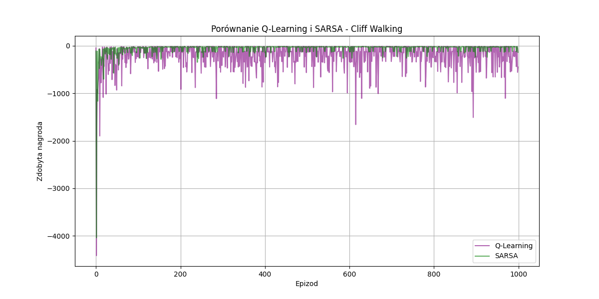
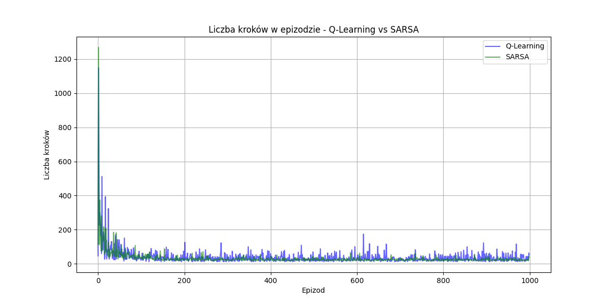
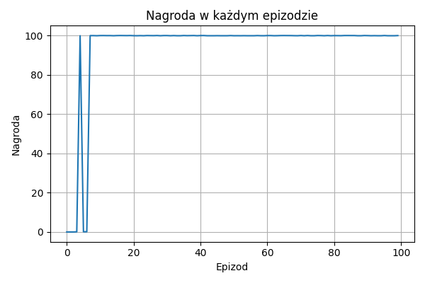
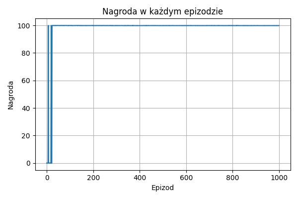
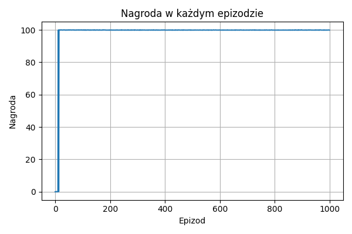

# GRA CLIFFWALKING

### **1.Wstęp**

CliffWalking to gra opierająca się na przejściu agenta z przez planszę 4x12 rozpoczynając na
polu startowym do osiągnięcia wyznaczonego celu, unikając przy tym wpadnięcia do klifu.

**Przestrzeń rozgrywki**

- Pozycja startowa gracza na polu [3,0]
- Docelowa pozycja gracza na pole [3,11]
- Przestrzeń klifu - wejście na nią powoduje reset gracza na start i duże kary punktowe - obejmuje pola od [3,1] do [3,10]
- Aktualna pozycja gracza = stan gry: obliczana jako "wiersz \* 12 + kolumna"

**Sterowanie i akcja**

Gracz ma wybór między czterema akcjami:

- 0 - ruch w górę
- 1 - ruch w prawo
- 2 - ruch w lewo
- 3 - ruch w dół

**Nagrody**

- Każdy krok gracza "-1"
- Wpadnięcie do klifu "-100"

**Koniec gry**

Gra zostaje zakończona w momencie osiągnięcia przez gracza dolecowej pozycji na planszy.

### **2.Uczenie ze wzmocnieniem**

## **Q-learning**

**Na czym polega?**

W metodzie Q-learning agent uczy się, jaką akcję warto wykonać w danym
stanie, by maksymalizować długoterminową sumę nagród.
W każdej iteracji aktualizuje wartość Q (quality),
czyli ocenę kombinacji stan-akcja. Q-learning jest
algorytmem off-policy – uczy się na podstawie najlepszej możliwej
akcji, niezależnie od tego, jaką naprawdę wykonał agent.
Dzięki temu potrafi szybciej znaleźć optymalne rozwiązanie,
ale czasem bardziej ryzykuje.

**Implementacja**

W naszym projekcie zastosowaliśmy Q-learning do uczenia agenta, jak
bezpiecznie przejść przez planszę i dotrzeć do celu,
unikając klifu. Agent buduje tablicę Q o wymiarach
[liczba_stanów, liczba_akcji] i aktualizuje jej wartości po każdym
kroku według równania Bellmana. Zastosowano ε-greedy do zachowania
balansu między eksploracją a eksploatacją, a także współczynnik
dyskontowy γ = 0.9. Ta metoda dobrze sprawdza się w tym środowisku,
ponieważ pozwala agentowi szybko uczyć się optymalnych ścieżek – nawet
kosztem chwilowego ryzyka.

## **SARSA**

**Na czym polega?**

Jest to algorytm on-policy, co oznacza, że agent uczy się na podstawie
rzeczywistych decyzji, które podejmuje w danym epizodzie. Zamiast
patrzeć, co mogłoby być najlepsze w teorii, SARSA
bierze pod uwagę faktyczną kolejną akcję agenta. Dzięki temu uczy się
bardziej zachowawczo – unika ryzykownych tras, nawet jeśli są one
potencjalnie krótsze.

**Implementacja**

W implementacji SARSA użyliśmy bardzo podobnych parametrów jak przy
Q-learningu – ε-greedy, γ = 0.9 i tablicy Q. Główna różnica to sposób
aktualizacji Q: zamiast szukać najlepszej akcji w kolejnym stanie,
używamy rzeczywistej akcji, którą agent planuje wykonać. W rezultacie
agent unika brzegów klifu i wybiera bezpieczniejsze ścieżki. To
podejście sprawdza się szczególnie dobrze w środowiskach z dużymi
karami (jak -100 za wejście do klifu), gdzie ryzyko się nie opłaca.

### **3.Wyniki**

**Porównanie wyników**

Q-Learning:
Najwyższa liczba punktów: -13 w epizodzie 141
Czas wykonania : 1.433 sekund

SARSA:
Najwyższa liczba punktów: -17 w epizodzie 243
Czas wykonania : 0.662 sekund

**Porównanie hiperparametrów**

Wszystkie poniższe dane powstały po puszczeniu 1000 epizodów gry.

| algorytm   | alpha | gamma | epsilon | srednia_nagroda | najlepszy_wynik | srednia_kroki | czas  |
| :--------- | :---- | :---- | :------ | :-------------- | :-------------- | :------------ | :---- |
| Q-Learning | 0.1   | 0.9   | 0.1     | -58.504         | -13             | 25.636        | 0.735 |
| SARSA      | 0.1   | 0.9   | 0.1     | -37.153         | -15             | 27.352        | 0.492 |
| Q-Learning | 0.1   | 0.7   | 0.1     | -61.28          | -13             | 26.828        | 0.583 |
| SARSA      | 0.1   | 0.7   | 0.1     | -36.705         | -17             | 28.488        | 0.516 |
| Q-Learning | 0.1   | 0.9   | 0.3     | -194.907        | -13             | 39.18         | 1.225 |
| SARSA      | 0.1   | 0.9   | 0.3     | -58.872         | -17             | 33.627        | 0.871 |
| Q-Learning | 0.1   | 0.7   | 0.3     | -191.222        | -13             | 39.95         | 1.092 |
| SARSA      | 0.1   | 0.7   | 0.3     | -180.322        | -17             | 154.978       | 3.027 |
| Q-Learning | 0.3   | 0.9   | 0.1     | -54.856         | -13             | 20.008        | 0.386 |
| SARSA      | 0.3   | 0.9   | 0.1     | -31.041         | -17             | 23.418        | 0.37  |
| Q-Learning | 0.3   | 0.7   | 0.1     | -53.397         | -13             | 20.133        | 0.356 |
| SARSA      | 0.3   | 0.7   | 0.1     | -108.322        | -17             | 101.986       | 1.614 |
| Q-Learning | 0.3   | 0.9   | 0.3     | -177.728        | -13             | 33.287        | 0.677 |
| SARSA      | 0.3   | 0.9   | 0.3     | -72.635         | -17             | 47.984        | 1.004 |
| Q-Learning | 0.5   | 0.9   | 0.1     | -54.232         | -13             | 18.79         | 0.339 |
| SARSA      | 0.5   | 0.9   | 0.1     | -320.481        | -17             | 310.68        | 5.512 |
| Q-Learning | 0.5   | 0.7   | 0.1     | -54.481         | -13             | 18.94         | 0.35  |

### **4.Wnioski**

Na podstawie przeprowadzonych eksperymentów można wyciągnąć kilka istotnych wniosków:

1. Skuteczność metod uczenia ze wzmocnieniem:

- Q-learning, który jest algorytmem off-policy znacznie częściej wybiera
  optymalne, a równocześnie bardziej ryzykowne ścieżki po brzegu klifu, co pozwala
  na znalezienie szybszego dotarcia do celu.
- SARSA, która natomiast jest algorytmem on-policy, wybiera bezpieczniejsze stategie
  ,trzymając się w pewnej odległości od klifu, co pozwala na zminimalizowanie kar, ale wydłuża drogę do celu.

2. Q-learning jest bardziej skuteczny w uczeniu się najkrótszych tras, ale często generuje przy tym większe kary.
3. SARSA jest mało skuteczna w odnajdywaniu najmniej kosztownej trasy, za to w całokształcie generuje niższe kary.
4. Znaczący wpływ hiperparametrów:

- wysokie epsilony (exploration rate) prowadzą do większej eksploracji oniżając przy tym jakość nagród,
- wyższe alfa (learning rate) pozwala na szybszą naukę, ale powoduje niestabilność wyników,
- zmniejsze nie gammy (wspołczynnik dyskontowy) wpływa negatywnie na długoterminowe decyzje obniżając jakość wyników.

# **GRA MOUNTAIN CAR CONTINUOUS**

## **1. Wstęp**

MountainCarContinuous to gra opierająca się na kontrolowaniu pojazdu, który ma na celu dotarcie na szczyt wzniesienia, wykorzystując swoją prędkość do wspinania się na górę. Gra odbywa się w przestrzeni jednowymiarowej, gdzie agent musi sterować siłą przyspieszenia, aby zdobyć wystarczający pęd i wspiąć się na górę.

### **Przestrzeń rozgrywki**

- **Początkowa pozycja agenta**: Pojazd znajduje się na dole wzniesienia, zazwyczaj w okolicy `x ≈ -0.5`, z małą początkową prędkością.
- **Docelowa pozycja agenta**: Celem jest dotarcie do pozycji `x >= 0.45`, która symbolizuje szczyt wzniesienia.
- **Obszar gry**: Gra odbywa się w przestrzeni 1D, a agent wykonuje ciągłe akcje, sterując siłą przyspieszenia.

### **Sterowanie i akcja**

- **Akcja**: Siła przyspieszenia mieści się w zakresie od `-1.0` (maksymalne przyspieszenie w lewo) do `+1.0` (maksymalne przyspieszenie w prawo).

### **Nagrody**

- **Za każdy krok**: kara w postaci `-a²`, gdzie `a` to wartość przyspieszenia. Oznacza to, że agent jest karany za użycie dużej siły, co motywuje go do ekonomicznego poruszania się.
- **Osiągnięcie celu**: nagroda +100, przyznawana natychmiast po osiągnięciu pozycji `x >= 0.45`.

### **Koniec gry**

Gra kończy się, gdy:

- Agent osiągnie cel (`x >= 0.45`), lub
- Zostanie osiągnięty maksymalny czas trwania epizodu (999 kroków).

---

## **2. Uczenie ze wzmocnieniem**

### **PPO (Proximal Policy Optimization)**

PPO to nowoczesna metoda uczenia ze wzmocnieniem oparta na optymalizacji polityki. Algorytm ten maksymalizuje oczekiwaną sumę nagród poprzez bezpieczne i stabilne aktualizacje polityki.

- PPO stosuje mechanizm „klipowania” zmian w polityce, co zapobiega dużym skokom wartości i zwiększa stabilność uczenia.
- Jest to algorytm **on-policy**, co oznacza, że aktualizacje są dokonywane na podstawie danych wygenerowanych przez bieżącą politykę.
- Jest prostszy i bardziej niezawodny w porównaniu do starszych metod, takich jak TRPO.

### **Implementacja**

Do implementacji wykorzystano biblioteki:

- `gymnasium` do stworzenia środowiska gry,
- `stable_baselines3` do treningu modelu PPO,
- `VecNormalize` do normalizacji obserwacji.

Agent został wytrenowany w środowisku **MountainCarContinuous-v0**, ucząc się kontrolować siłę przyspieszenia tak, aby osiągać cel jak najszybciej i jak najbardziej efektywnie.

---

## **3. Wyniki**

Po zakończeniu treningu agenta w środowisku `MountainCarContinuous-v0`, przeanalizowano wyniki pod kątem:

- Otrzymywanych nagród w każdym epizodzie
- Liczby kroków potrzebnych do osiągnięcia celu
- Maksymalnej osiągniętej pozycji

### **Porównanie nagród w zależności od współczynnika dyskontowego γ**

Współczynnik dyskontowy (gamma, γ) określa, jak bardzo agent "dba" o przyszłe nagrody. Poniżej przedstawiono wpływ różnych wartości γ na wyniki:

---

### **γ = 0.9765**

| Epizod | Nagroda   | Maksymalna Pozycja | Kroki do Celu |
| ------ | --------- | ------------------ | ------------- |
| 0.0    | -0.036738 | -0.191889          | -1.0          |
| 1.0    | -0.040459 | -0.042791          | -1.0          |
| 2.0    | -0.041366 | -0.042791          | -1.0          |
| 3.0    | -0.100000 | -0.042791          | -1.0          |
| 4.0    | -0.050054 | 0.602631           | 898.0         |
| 5.0    | -0.064874 | 0.602631           | 1897.0        |
| 6.0    | -0.005479 | 0.602631           | 848.0         |
| 7.0    | 99.999320 | 0.602631           | 1662.0        |
| 8.0    | -0.078859 | 0.602631           | 613.0         |
| 9.0    | -0.051665 | 0.602631           | 1612.0        |
| 10.0   | -0.045746 | 0.602631           | 563.0         |
| 11.0   | -0.004067 | 0.602631           | 1562.0        |
| 12.0   | -0.068066 | 0.602631           | 513.0         |
| 13.0   | -0.001290 | 0.602631           | 1512.0        |
| 14.0   | -0.025643 | 0.602631           | 463.0         |
| 15.0   | -0.051897 | 0.602631           | 1462.0        |
| 16.0   | -0.100000 | 0.602631           | 413.0         |
| 17.0   | -0.009664 | 0.602631           | 1412.0        |
| 18.0   | -0.100000 | 0.602631           | 363.0         |
| 19.0   | 99.967766 | 0.602631           | 1329.0        |
| 20.0   | -0.000550 | 0.602631           | 280.0         |
| 21.0   | -0.087202 | 0.602631           | 1279.0        |
| 22.0   | -0.080753 | 0.602631           | 230.0         |
| 23.0   | 99.970410 | 0.602631           | 1069.0        |
| 24.0   | 99.964070 | 0.602631           | 1736.0        |
| 25.0   | 99.969340 | 0.602631           | 254.0         |
| 26.0   | 99.998480 | 0.602631           | 986.0         |
| 27.0   | 99.977480 | 0.602631           | 1505.0        |
| 28.0   | 99.900000 | 0.602631           | 228.0         |
| 29.0   | 99.958570 | 0.602631           | 668.0         |

- Agent potrzebował około 10 epizodów, aby zacząć konsekwentnie osiągać maksymalną nagrodę (100).
- Widoczne są dwa skoki nagród — początkowe próby, a następnie szybka poprawa strategii.
- Stabilność po wczesnym okresie eksploracji.

---

### **γ = 0.98**

| Epizod | Nagroda   | Maksymalna Pozycja | Kroki do Celu |
| ------ | --------- | ------------------ | ------------- |
| 0.0    | -0.100000 | 0.647474           | 998.0         |
| 1.0    | -0.070406 | 0.647474           | 1997.0        |
| 2.0    | -0.100000 | 0.647474           | 948.0         |
| 3.0    | -0.017939 | 0.647474           | 1947.0        |
| 4.0    | -0.058896 | 0.647474           | 898.0         |
| 5.0    | -0.100000 | 0.647474           | 1897.0        |
| 6.0    | -0.005507 | 0.647474           | 848.0         |
| 7.0    | -0.001742 | 0.647474           | 1847.0        |
| 8.0    | -0.100000 | 0.647474           | 798.0         |
| 9.0    | 99.951195 | 0.647474           | 1403.0        |
| 10.0   | -0.076981 | 0.647474           | 354.0         |
| 11.0   | -0.006907 | 0.647474           | 1353.0        |
| 12.0   | 99.970280 | 0.647474           | 136.0         |
| 13.0   | 99.910774 | 0.647474           | 828.0         |
| 14.0   | -0.007713 | 0.647474           | 1827.0        |
| 15.0   | 99.900000 | 0.647474           | 317.0         |
| 16.0   | 99.982880 | 0.647474           | 1031.0        |
| 17.0   | 99.998820 | 0.647474           | 1950.0        |
| 18.0   | 99.993970 | 0.647474           | 317.0         |
| 19.0   | 99.922325 | 0.647474           | 804.0         |
| 20.0   | -0.018088 | 0.647474           | 1803.0        |
| 21.0   | 99.992240 | 0.647474           | 80.0          |
| 22.0   | 99.967310 | 0.647474           | 495.0         |
| 23.0   | 99.965650 | 0.647474           | 826.0         |
| 24.0   | 99.947914 | 0.647474           | 1132.0        |

- Również bardzo szybka konwergencja, choć możliwe są nieco większe wahania na początku.
- Bardzo szybka konwergencja i minimalna liczba epizodów z niską nagrodą.

---

### **γ = 0.987**

**Wyniki**
| Epizod | Nagroda | Maksymalna Pozycja | Kroki do Celu |
|--------|---------|---------------------|----------------|
| 0.0 | -0.100000 | 0.986133 | 998.0 |
| 1.0 | -0.000139 | 0.986133 | 1997.0 |
| 2.0 | -0.005772 | 0.986133 | 948.0 |
| 3.0 | -0.046811 | 0.986133 | 1947.0 |
| 4.0 | -0.001381 | 0.986133 | 898.0 |
| 5.0 | -0.011804 | 0.986133 | 1897.0 |
| 6.0 | -0.003015 | 0.986133 | 848.0 |
| 7.0 | -0.100000 | 0.986133 | 1847.0 |
| 8.0 | -0.055769 | 0.986133 | 798.0 |
| 9.0 | -0.015827 | 0.986133 | 1797.0 |
| 10.0 | -0.001606 | 0.986133 | 748.0 |
| 11.0 | 99.900000 | 0.986133 | 1676.0 |
| 12.0 | 99.900000 | 0.986133 | 592.0 |
| 13.0 | -0.001159 | 0.986133 | 1591.0 |
| 14.0 | 99.967510 | 0.986133 | 130.0 |
| 15.0 | 99.999350 | 0.986133 | 620.0 |
| 16.0 | 99.991680 | 0.986133 | 1031.0 |
| 17.0 | 99.988490 | 0.986133 | 1477.0 |
| 18.0 | 99.968470 | 0.986133 | 1950.0 |
| 19.0 | 99.933960 | 0.986133 | 538.0 |

- Agent bardzo szybko nauczył się optymalnej strategii.
- Już po kilku epizodach nagrody osiągają wartość 100 i utrzymują się na tym poziomie.
- Stabilne osiąganie wysokich nagród po kilku epizodach.

---

### **Wnioski z porównania gamma**

- Im wyższa wartość γ, tym większa waga przypisywana przyszłym nagrodom, co może sprzyjać lepszemu planowaniu.
- Wartości gamma w zakresie 0.98–0.987 zapewniają bardzo dobre rezultaty i szybką konwergencję.
- Niska gamma może prowadzić do krótkowzroczności agenta, ale też może ograniczać nadmierne eksplorowanie.

---

## **4. Wnioski**

### **1. Skuteczność PPO**

- PPO okazał się stabilnym i efektywnym algorytmem w środowisku `MountainCarContinuous-v0`.
- Agent nauczył się szybko osiągać cel poprzez optymalną strategię poruszania się i wykorzystywania pędu.

### **2. Szybkość osiągania celów**

- Po około 2-5 epizodach agent zaczął regularnie osiągać cel, maksymalizując nagrody.

### **3. Znaczenie hiperparametrów**

- Parametry takie jak współczynnik dyskontowy γ, liczba kroków (n_steps) czy współczynnik uczenia (learning_rate) mają kluczowy wpływ na skuteczność algorytmu.
- W eksperymentach zauważono, że:
  - **gamma = 0.90** – agent nie był w stanie nauczyć się osiągać celu; prawdopodobnie zbyt krótkowzroczna strategia;
  - **gamma = 0.98** – dobry kompromis między szybkim uczeniem a planowaniem;
  - **gamma = 0.99** – zbyt duże znaczenie przyszłych nagród skutkowało brakiem postępu; agent nie potrafił wyjść poza bardzo niskie nagrody.

---

## **5. Zakończenie**

Model PPO z powodzeniem nauczył się sterować agentem w środowisku MountainCarContinuous, osiągając wysoką skuteczność w zdobywaniu nagrody i szybkim dotarciu do celu. Wybór odpowiednich hiperparametrów i stabilny algorytm były kluczowe dla sukcesu.
